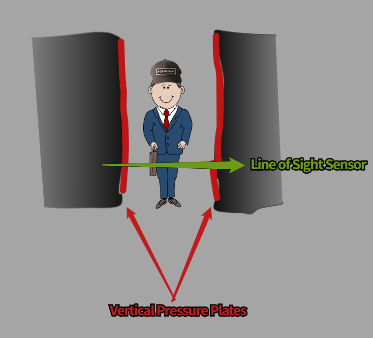

# Elevator Code

The Elevator is a used to transport people vertically from and to any floor in this building.
This building had 8 floors.  It has a net capacity of 1500 lbs.  If it is within 10% of the max weight, it will not operate.  A buzzer will alert passengers that it is at an unsafe weight, and some will need to step off and await the next transport.

The primary control for the elevator is inside the elevator cabin itself.  It contains a control panel with 11 buttons.  The first floor is the lobby, and is refered to as L, then floors 2 - 8, Door Open, Door Close, and Alarm.  It also has a key to manually shut down operation.  At the top of this panel is a n LCD display which shows the current floor.  The floor buttons contain lights, and will light up when they are selected.

|   |   |
|:---:|:---:|
| L | 2 |
| 3 | 4 |
| 5 | 6 |
| 7 | 8 |
|Close | Open |
| KEY | Alarm |

As floors are selected from inside the cabin, the elevator will service them with priority, as long as it doesn't have to change directions.  If the elevator is traveling from the 3rd floor to the 5th floor, and both the 8th floor, and the 2nd floor are added, it will serve the 8th floor first.

The elevator also needs to be able to be called from any floor.  Floors 2 through 7 have a two button control panel beside the elevator.  One button calls for a trip up, the other calls it for a trip down.  The 1st and 8th floor only have one call button, since only one direction is possible from their positions.  If it is called from multiple floors, it needs to be able to add stops, and pick up passengers efficiently.  It doesn't need to pick up passengers who are going the opposite direction.

When the elevator stops on a floor that a passenger has called/requested, the elevator will make sure it is positioned level with the floor, the gears will lock the elevator in place, and the doors will open.

The elevator opens horizontally, the door seems to comprise to two parts, the right and left side that meet in the middle when closed.

In reality, the elevator door consists of 18 major parts.

1. Inner Door
    1. Right Side
    1. Left Side
1. Outer Doors
    1. Each Floor
        1. Right Side
        1. Left Side
    1. Each Floor
        1. Right Side
        1. Left Side
    1. Each Floor
        1. Right Side
        1. Left Side
    1. Each Floor
        1. Right Side
        1. Left Side
    1. Each Floor
        1. Right Side
        1. Left Side
    1. Each Floor
        1. Right Side
        1. Left Side
    1. Each Floor
        1. Right Side
        1. Left Side
    1. Each Floor
        1. Right Side
        1. Left Side

The inner door is part of the cabin, it keeps passenger secure in the elevator.

The outer doors are stationary on each floor.  They keep people from falling into the open elevator shaft, or having limbs crushed by the passing elevator ([see what to avoid.](https://en.wikipedia.org/wiki/Guillotine))

Doors must be closed before elevator can move.

The exterior on the inner door has a line of sight sensor, and a pressure plate sensor.

The line of sight sensor is two feet off the floor.  The doors will not close if the line of sight sensor's circuit is broken.  When the circuit is closed, it starts a 1500ms timer before closing doors.

Each side of the door has a rubberized arm that leads the doors as they close.  The arm is attached to a pressure plate sensor.  If they meet any resistance, the doors motion is reversed, and they open back up.  This will restart the closing process with the line of sight sensor and the delay.

When the elevator has completed all its assignments, and has no other calls, it returns to the lobby and waits.

Out of Operation Conditions

***

START

INIT Variables

    currentFloor
    setFloorUp [Array with 0 position as next]
    setFloorDown [Array with 0 position as next]
    doorsClosed
    goingUp
    callButton [Floor, Direction]

DEFINE Functions

    callElevator()
        What to do when the elevator is called to a floor
    selectFloor()
        What to do when a floor is selected.  If selected inside elevator, floor choice is primary, if set from call button, it is secondary
    whileOpen()
        WHILE doorsClosed = FALSE
            Elevator can't change floors
    myWay()
        Elevator only stops to pick up passengers if they are going same direction as elevator

    isAlarm()
        Elevator will shut down if Fire Alarm is triggered in building

Hitting a button to send the elevator to a specific floor will set setFloor to that floor

If currentFloor is < setFloor, goingUp := True

If the Doors are open, the elevator won't move. This is of critical safety, so needs to have multiple checks.

If currentFloor = setFloor then the elevator needs to stop and the doors open.  doorClosed := False

If goingUp = FALSE elevator needs to stop at all floors 

---

    Var upStopAt []
    Var downStopAt []

    Function selectFloor
        sets floor elevator needs to go to.  If it is Up, adds floor to upStopAt array, else downStopArray

        Use Logic inside elevator, on floor call button, to inputs will be available

    Function callButtonUp
        Input push CONSTfloorValue upStopAt []

    Function callButtonDown
        Input push CONSTfloorValue downStopAt []

    Function cabinButton
        INPUT "BUTTON"
            If BUTTON > currentFloor
                Push BUTTON upStopAt[]
            Else If BUTTON < currentFloor
                Push BUTTON downStopAt[]
            Else
                openDoors

    Function stopAtFloor
        If  goingUp === True
            If upStopAt.includes(currentFloor)
                openDoors
            moveElevatorUp()
        Else
            If downStopAt.contains(currentFloor)
                openDoors
            moveElevatorDown()

    Function moveElevatorUp
        for loop if currentFloor =/ upStopAt [Any Value in Array]
            function moveEleGear(1)

    Function moveElevatorDown
        for loop if currentFloor =/ downStopAt [Any Value in Array]
        function moveEleGear(-1)

    Function openDoors
        Open the doors

    
            
